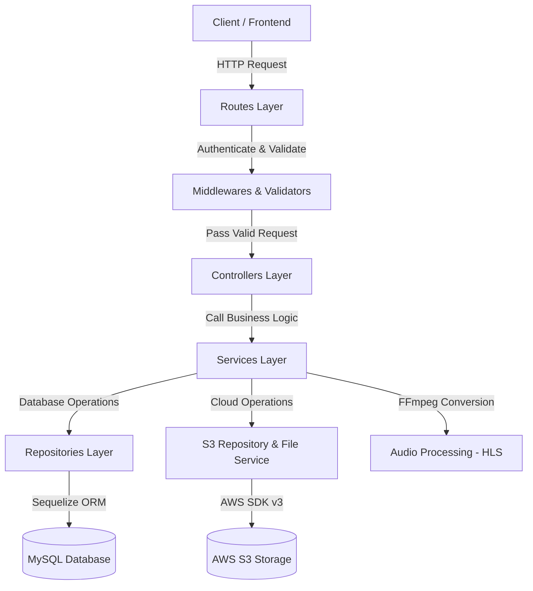

# 🎵 MusicBox Backend - Kiến trúc Hệ thống (System Architecture)

Dự án **MusicBox Backend** được xây dựng trên nền tảng **Node.js**, **Express.js** và **Sequelize ORM** kết hợp **MySQL**, **Redis**, **AWS S3** và **FFmpeg**. Hệ thống tuân thủ mô hình kiến trúc phân lớp chuẩn (**Layered Architecture / Clean Architecture**), tách biệt rõ ràng giữa Routing, Controller, Business Logic (Service), và Data Access (Repository).

---

## 🏛️ 1. Tổng quan Kiến trúc Phân lớp (Layered Architecture)

Hệ thống được chia thành 5 lớp chính theo nguyên lý **Single Responsibility Principle (SRP)** và **Separation of Concerns**:



### Các lớp chính trong hệ thống:

1. **Routes Layer (`/routes`)**:
   - Định nghĩa các HTTP Endpoints (GET, POST, PUT, DELETE).
   - Gắn các Middleware xác thực (`authenticate`), phân quyền (`authorize`), upload file (`songUpload`) và kiểm tra dữ liệu (`validators`).

2. **Middlewares & Validators Layer (`/middlewares`, `/validators`)**:
   - `auth.middleware.js`: Kiểm tra Access Token (JWT) từ Header/Cookie.
   - `role.middleware.js`: Phân quyền người dùng (`ADMIN`, `USER`).
   - `upload.middleware.js`: Xử lý nhận file đa phần (`multipart/form-data`) bằng `Multer` lưu giữ vào bộ nhớ RAM (`memoryStorage`).
   - `error.middleware.js` & `notFound.middleware.js`: Xử lý lỗi toàn cục (Global Error Handling) và lỗi 404 Route.
   - `rateLimit.middleware.js`: Giới hạn tần suất gửi request phòng chống Brute Force / DDoS.

3. **Controllers Layer (`/controllers`)**:
   - Tiếp nhận dữ liệu từ `req.params`, `req.query`, `req.body` và `req.files`.
   - Đóng vai trò điều hướng, gọi đến hàm tương ứng trong lớp **Service**.
   - Chuẩn hóa và trả về câu phản hồi HTTP response (`res.status(...).json(...)`).

4. **Services Layer (`/services`)**:
   - Nơi chứa toàn bộ **Logic nghiệp vụ (Business Logic)** của ứng dụng.
   - Quản lý **Database Transactions** (`db.sequelize.transaction()`) đảm bảo tính toàn vẹn ACID.
   - **Xử lý Audio HLS & S3**: Gọi `FileService` để dùng **FFmpeg** mã hóa file nhạc MP3 thành chuẩn HLS (playlist `.m3u8` + các phân đoạn `.ts`), sau đó tải lên AWS S3.
   - Tự động thực hiện **Rollback** (xóa file vừa tải lên S3 nếu lỗi CSDL xảy ra) hoặc **Dọn dẹp tài nguyên cũ** (xóa file cũ trên S3 sau khi cập nhật/xóa thành công).

5. **Repositories Layer (`/repositories`)**:
   - Đóng vai trò là lớp truy xuất dữ liệu (Data Access Layer - DAL).
   - Trực tiếp thao tác với cơ sở dữ liệu thông qua **Sequelize Models**.
   - Đảm bảo việc truy vấn (findAll, findByPk, create, update, destroy) được tái sử dụng ở nhiều nơi mà không bị lặp mã.

6. **Models & Migrations Layer (`/models`, `/migrations`)**:
   - **Models**: Khai báo cấu trúc bảng, kiểu dữ liệu và định nghĩa mối quan hệ (`associate`: `hasMany`, `belongsTo`, `belongsToMany`).
   - **Migrations**: Quản lý lịch sử thay đổi cấu trúc bảng dưới CSDL MySQL thông qua Sequelize CLI.

---

## 📂 2. Cấu trúc Thư mục Dự án

```text
backend/
├── config/                  # Cấu hình CSDL (MySQL, Sequelize), S3 client, Redis
│   ├── config.json
│   ├── configdb.js
│   └── s3.js
├── controllers/             # Tiếp nhận request và điều hướng phản hồi HTTP
│   ├── artist.controller.js
│   ├── auth.controller.js
│   ├── song.controller.js
│   └── topic.controller.js
├── middlewares/             # Xác thực JWT, phân quyền, upload, error handler
│   ├── auth.middleware.js
│   ├── error.middleware.js
│   ├── notFound.middleware.js
│   ├── rateLimit.middleware.js
│   ├── role.middleware.js
│   └── upload.middleware.js
├── migrations/              # Bản vẽ khởi tạo & cập nhật bảng CSDL
│   ├── migration_01_create_user.js
│   ├── migration_02_create_refresh_token.js
│   ├── migration_03_create_artist.js
│   ├── migration_04_create_album.js
│   ├── migration_05_create_topic.js
│   ├── migration_06_create_song.js
│   ├── migration_07_create_song_artist.js
│   ├── migration_08_create_like.js
│   ├── migration_09_create_playlist.js
│   └── migration_10_create_playlist_song.js
├── models/                  # Các Sequelize Models & định nghĩa quan hệ
│   ├── album.js
│   ├── artist.js
│   ├── index.js
│   ├── like.js
│   ├── playlist.js
│   ├── playlist_song.js
│   ├── refreshToken.js
│   ├── song.js
│   ├── song_artist.js
│   ├── topic.js
│   └── user.js
├── repositories/            # Lớp thao tác CSDL trực tiếp (Data Access Layer)
│   ├── album.repository.js
│   ├── artist.repository.js
│   ├── like.repository.js
│   ├── playlist.repository.js
│   ├── playlist_song.repository.js
│   ├── refreshToken.repository.js
│   ├── s3.repository.js
│   ├── song.repository.js
│   ├── song_artist.repository.js
│   ├── topic.repository.js
│   └── user.repository.js
├── routes/                  # Định tuyến các API Endpoints
│   ├── artist.routes.js
│   ├── auth.routes.js
│   ├── song.route.js
│   └── topic.route.js
├── services/                # Logic nghiệp vụ, Transaction, HLS, S3 File handling
│   ├── artist.service.js
│   ├── auth.service.js
│   ├── email.service.js
│   ├── file.service.js
│   ├── otp.service.js
│   ├── playlist.service.js
│   ├── song.service.js
│   ├── token.service.js
│   └── topic.service.js
├── validators/              # Kiểm tra ràng buộc dữ liệu đầu vào (Validation)
│   ├── artist.validator.js
│   ├── auth.validator.js
│   ├── song.validator.js
│   └── topic.validator.js
├── server.js                # Entry point chính của ứng dụng Express
├── package.json
└── .env                     # Biến môi trường
```

---

## 🔄 3. Quy trình Xử lý Nhạc HLS & Upload AWS S3

Khi người dùng thực hiện **Tạo (Create)** hoặc **Cập nhật (Update)** bài hát:

1. **Multer Middleware**: Đọc file nhạc và ảnh vào bộ nhớ RAM dưới dạng `Buffer`.
2. **Audio Duration Extraction**: `FileService.getAudioDuration` ghi tạm buffer vào thư mục tạm của HĐH (`os.tmpdir()`), dùng `ffprobe` lấy thời lượng bài hát theo giây, sau đó lập tức dọn dẹp file tạm.
3. **FFmpeg HLS Conversion**:
   - Chuyển đổi mã hóa bài hát MP3 thành định dạng **HLS (HTTP Live Streaming)** bao gồm 1 file chỉ mục `playlist.m3u8` và chuỗi phân đoạn nhạc `segment_xxx.ts` (mỗi segment ~6 giây).
4. **AWS S3 Upload**:
   - Tải toàn bộ file `.ts` và file `playlist.m3u8` lên S3 theo cấu trúc thư mục `audios/{audioId}/...`.
   - Tải file ảnh bìa lên S3 theo đường dẫn `images/{uuid}.jpg`.
5. **Transaction & Rollback**:
   - Mở Transaction CSDL.
   - Lưu thông tin bài hát và bảng liên kết `song_artists`.
   - Nếu thành công: Commit Transaction và dọn dẹp các file cũ trên S3 (nếu là thao tác Update/Delete).
   - Nếu thất bại: Rollback CSDL và **xóa ngay lập tức các file mới vừa upload lên S3** để tránh rác dung lượng.

---

## ⚡ 4. Danh sách API Endpoints Chính

### 🔑 Authentication (`/api/auth`)
- `POST /register`: Đăng ký tài khoản người dùng mới.
- `POST /login`: Đăng nhập, nhận Access Token & Refresh Token.
- `POST /refresh-token`: Cấp lại Access Token từ Refresh Token.
- `POST /logout`: Đăng xuất và thu hồi Refresh Token.
- `POST /send-otp`: Gửi mã OTP xác thực qua Email.
- `POST /verify-otp`: Xác thực mã OTP.

### 🎤 Artist (`/api/artist`)
- `GET /all`: Lấy danh sách tất cả nghệ sĩ.
- `GET /:artistId`: Lấy thông tin chi tiết nghệ sĩ.
- `POST /create`: Tạo nghệ sĩ mới (Upload ảnh đại diện) `[ADMIN]`.
- `PUT /update/:artistId`: Cập nhật thông tin nghệ sĩ `[ADMIN]`.
- `DELETE /delete/:artistId`: Xóa nghệ sĩ `[ADMIN]`.

### 📑 Topic (`/api/topic`)
- `GET /all`: Lấy danh sách tất cả chủ đề.
- `GET /:topicId`: Lấy thông tin chi tiết chủ đề.
- `POST /create`: Tạo chủ đề mới `[ADMIN]`.
- `PUT /update/:topicId`: Cập nhật chủ đề `[ADMIN]`.
- `DELETE /delete/:topicId`: Xóa chủ đề `[ADMIN]`.

### 🎵 Song (`/api/song`)
- `GET /all`: Lấy danh sách tất cả bài hát.
- `GET /:songId`: Lấy chi tiết bài hát (kèm thông tin nghệ sĩ).
- `GET /artist/:artistId`: Lấy danh sách bài hát theo Nghệ sĩ.
- `POST /create`: Tạo bài hát mới (Upload ảnh & audio HLS) `[ADMIN]`.
- `PUT /update/:songId`: Cập nhật bài hát (Hỗ trợ thay đổi ảnh/audio) `[ADMIN]`.
- `DELETE /delete/:songId`: Xóa bài hát & dọn dẹp file S3 `[ADMIN]`.

---

## 🛠️ 5. Hướng dẫn Khởi chạy Project

### Yêu cầu tiên quyết:
- **Node.js**: v18 trở lên.
- **MySQL**: Database đã được khởi tạo.
- **Redis**: Đang chạy trên local hoặc cloud (cho cache / session / OTP).
- **FFmpeg**: Đã được cài đặt trên máy tính hệ thống và được thêm vào `PATH`.

### Các bước cài đặt:
1. Cài đặt các gói phụ thuộc:
   ```bash
   npm install
   ```

2. Cấu hình biến môi trường trong `.env`:
   ```env
   PORT=8088
   NODE_ENV=development

   # Database
   DB_HOST=localhost
   DB_USER=root
   DB_PASSWORD=your_password
   DB_NAME=musicbox
   DB_PORT=3306

   # JWT
   JWT_SECRET=your_jwt_secret
   JWT_REFRESH_SECRET=your_refresh_secret

   # AWS S3
   AWS_ACCESS_KEY_ID=your_access_key
   AWS_SECRET_ACCESS_KEY=your_secret_key
   AWS_REGION=ap-southeast-1
   AWS_S3_BUCKET_NAME=your_bucket_name
   ```

3. Khởi chạy CSDL bằng Sequelize Migration:
   ```bash
   npx sequelize-cli db:migrate
   ```

4. Khởi chạy Server ở chế độ Development:
   ```bash
   npm run dev
   ```
